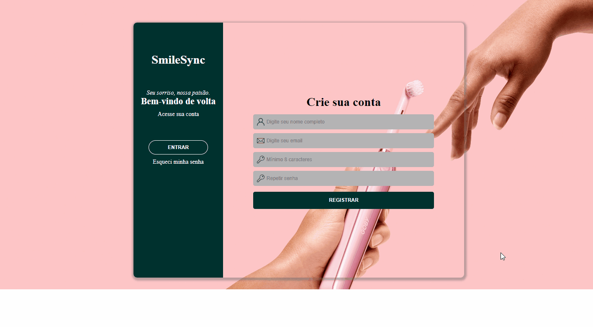

  <h1>SmileSync</h1>
  

> ## Descrição
   SmileSync é um sistema simples de gerenciamento de registros de pacientes para consultas odontológicas. Desenvolvido em JavaScript puro e SCSS, utiliza Local Storage para persistência de dados, permitindo operações básicas de CRUD (Criar, Ler, Atualizar, Deletar registros).

> ## Tecnologias

  - HTML
  - SCSS (arquivo `styles.scss`)
  - JavaScript (arquivos modularizados)
  - Local Storage

> ## Como usar

1. Faça o clone deste repositório: https://github.com/tiagofmuniz/smileSync.git
2. Abra o arquivo `index.html` em seu navegador.
3. Utilize o formulário inicial para registrar um conta.
4. Acesse o sistema através da conta criada.
5. Após acessar, utilize o formulário para adicionar novos registros de pacientes, agendar consultas e incluir observações.
6. Os registros são armazenados localmente no navegador usando Local Storage.
7. Senhas criadas devem ter pelo menos 8 caracteres.

> ## Funcionalidades

- Adição, visualização, edição e exclusão de registros de pacientes.
- Agendamento de consultas com data e horário.
- Inclusão de observações para cada paciente.

**Observação:** O sistema não requer servidor backend, pois utiliza Local Storage. Os dados são mantidos no navegador localmente.

> ## Ajustes pendentes

1. Estilização de alguns elementos como botões.
2. Readaptação para interface tabela.
3. Duplicata de botões ocorrendo em algumas situações.

  

  

  

